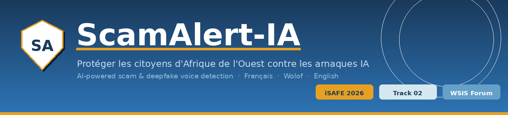
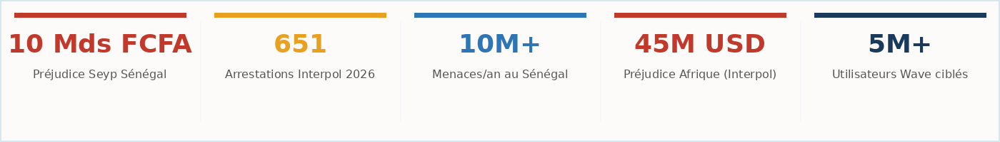
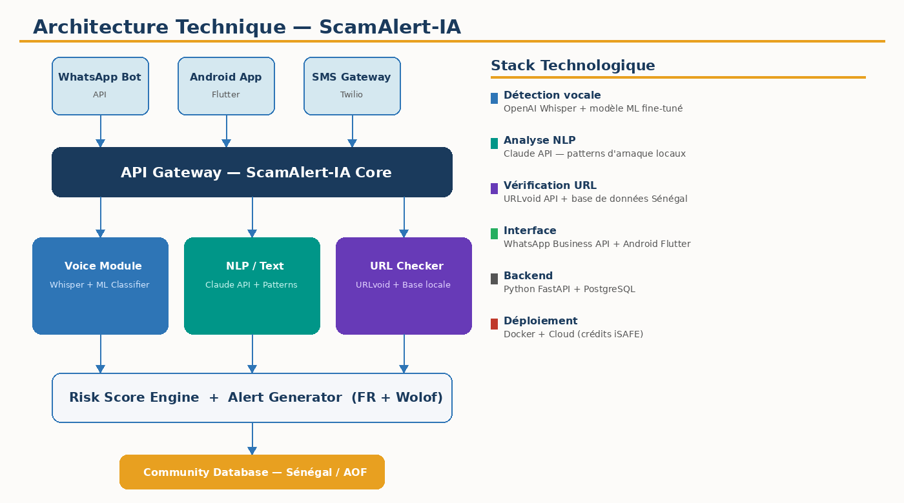
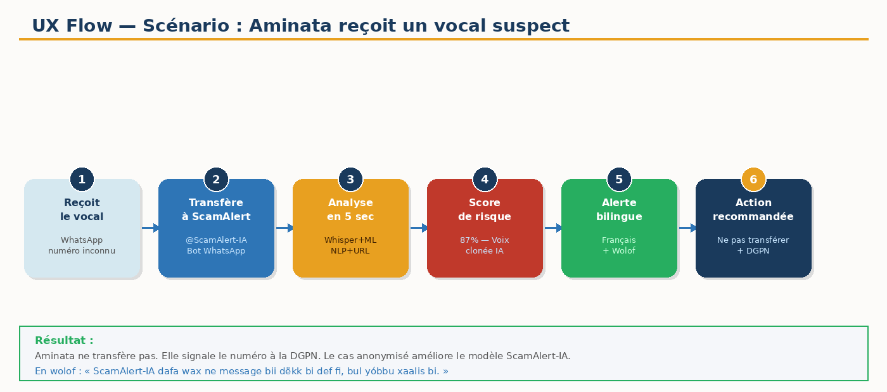
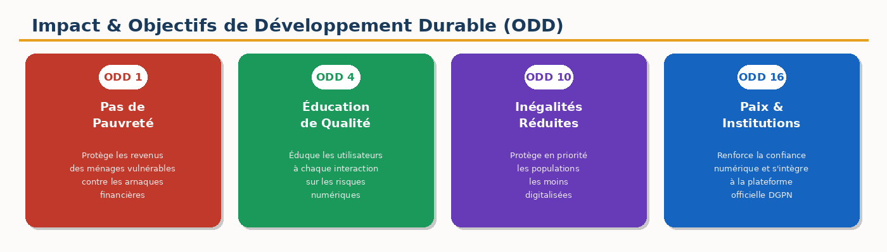

---

[]()
[]()
[]()
[]()

---

## 📊 The Problem by the Numbers



The most dangerous and **least locally addressed** vector: **AI-generated voice clones**.
Tools today can faithfully replicate a voice from as little as **3 seconds of audio**.
Scammers send WhatsApp voice messages impersonating a loved one or a Wave agent to demand an urgent transfer.
The victim recognizes the voice and sends the money.

> **No local solution currently exists to counter this phenomenon in Senegal.**

---

## 💡 The Solution

**ScamAlert-IA** is a multimodal AI agent accessible via WhatsApp or a lightweight Android app.
The user forwards a suspicious voice message, link, or text — ScamAlert-IA analyzes it in real time and responds **in French and in Wolof**.

---

## 🏗 Technical Architecture



---

## 🗺 UX Flow - User Journey



---

## 🌍 Impact & SDGs



---

## ✨ Key Features

- 🎙 **Voice clone detection**: Whisper + ML model fine-tuned on local data
- 🔗 **Link verification**: Wave, Orange Money, and government portal phishing
- 📝 **NLP analysis**: scam patterns typical to Senegal
- 🗣 **Multilingual**: alerts in both French AND Wolof
- 📚 **Continuous education**: every detection = a lesson
- 🤝 **Community intelligence**: anonymized reports that improve the model

---

## 👥 The Team

| Role | Member |
|------|--------|
| Team Lead | Mohamed COULIBALY |
| Member | Mariama NDIAYE |

*A team of student-workers in engineering — Dakar, Senegal 🇸🇳*

---

## 🚀 Installation

```bash
git clone https://github.com/galsencode12/ScamAlert-AI.git
cd ScamAlert-AI
pip install -r requirements.txt
python app.py
```

---

*"Tomorrow's digital world will be safe — or it won't exist."*

**ScamAlert-IA | Dakar, Senegal 🇸🇳 | iSAFE Hackathon 2026**
